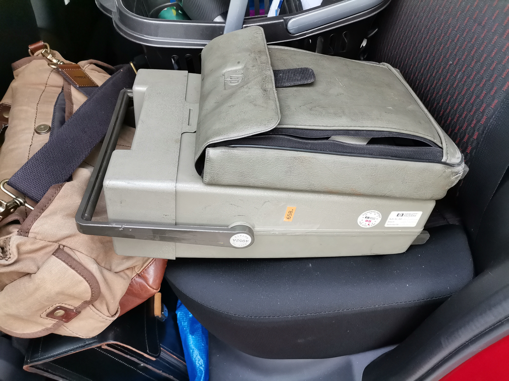
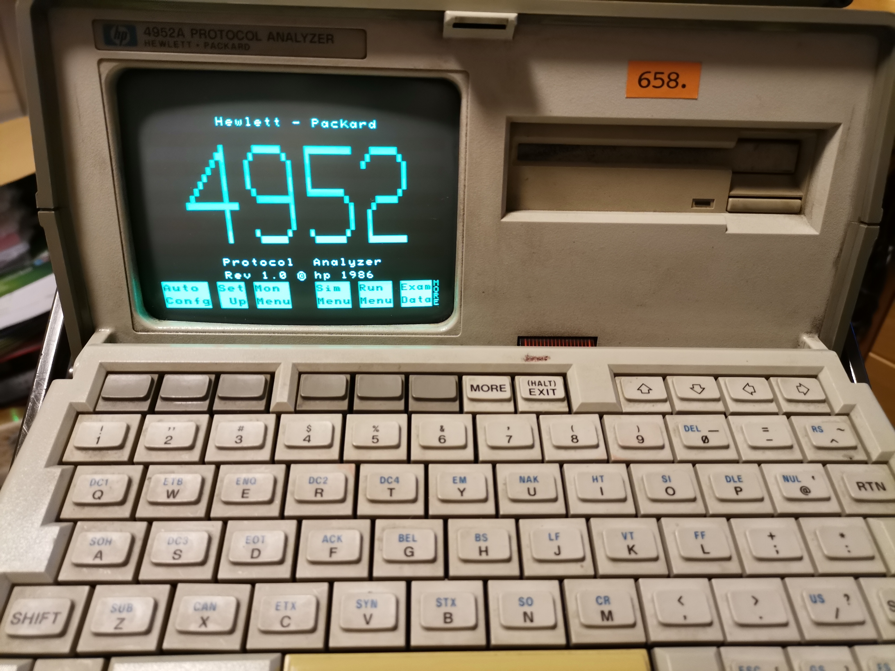
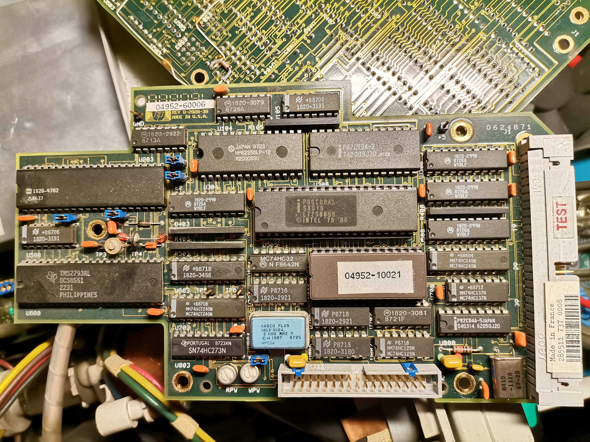
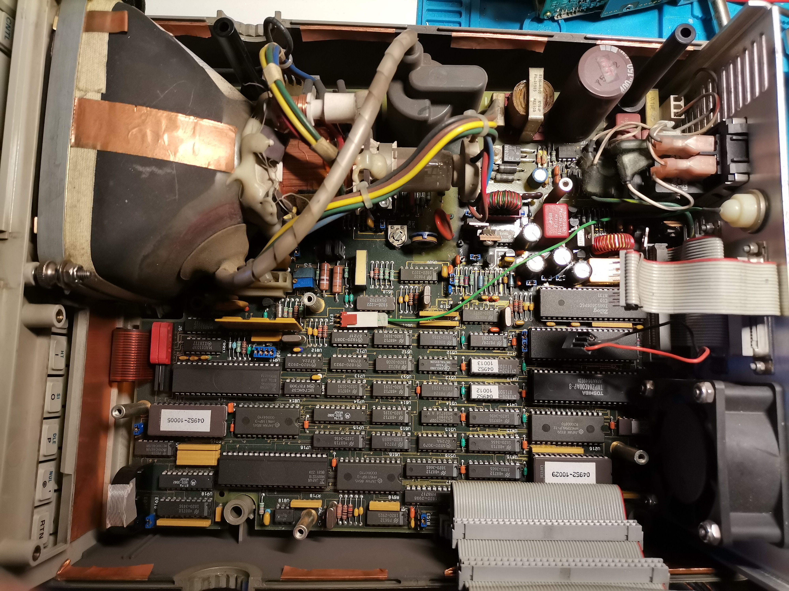
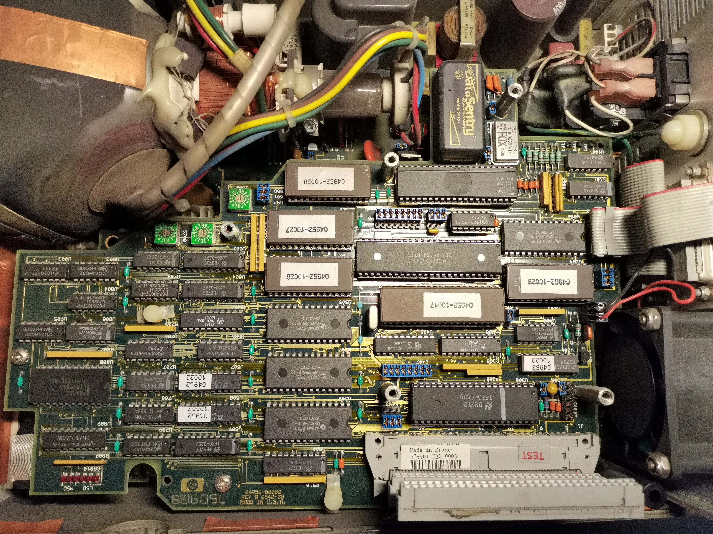
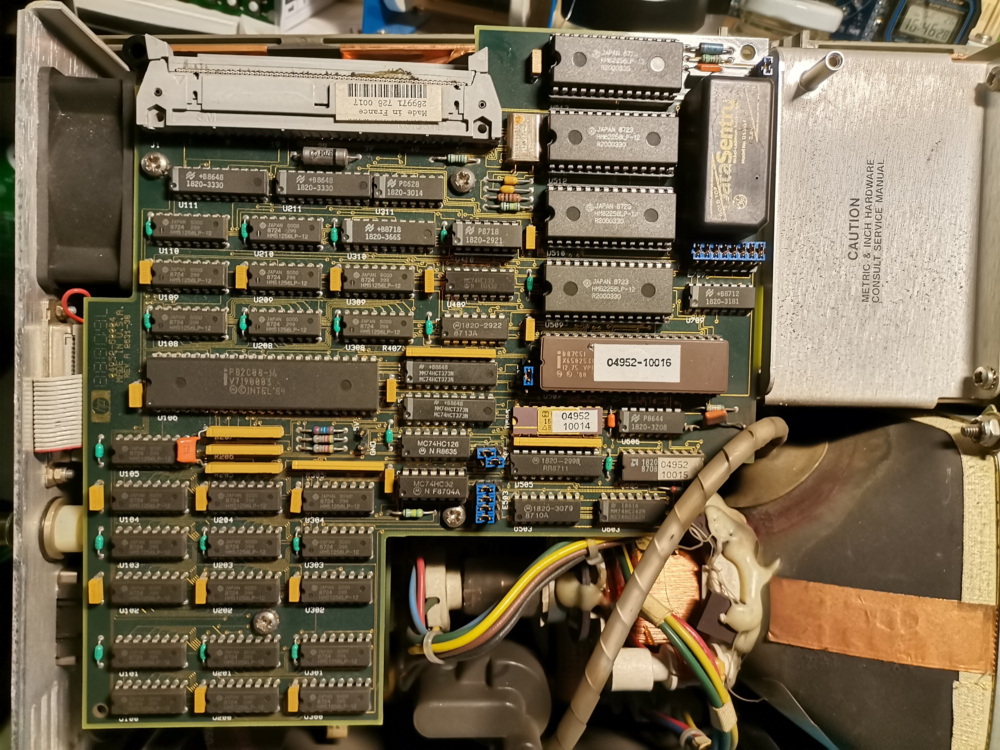

# HP 4952A Protocol Analyzer

## How it all began
When browsing the eBay store of a local electronics recycler, I stumbled across the HP 4952A Protocol Analyzer.
I had already read a lot about this unit and went to buy it. After some haggling and exchange of an amount of local currency I took it home.
 

After that it was all disassembly, cleaning, swapping the Rifa smoke bombs, and reassembly. I also took the opportunity to dump the EPROMs and the two 87C51 microcontrollers. The latter is what this repository is about.

Version information: My HP 4952A is Version 1.0 from 1986.
 
 
## The ROMs
The HP4952A is sprinkled with a healthy number of CPUs (68k, Z80),  µCs (87C51), and a bunch of EPROMs (27C256, 27C512). These serve as firmware modules for the floppy controller and as various character ROMs for the actual analyzer. I haven't found all their functions and duties as I am still missing the correct service manual. The one I have is from the 4951C and only goes so far. PCB layouts and component designations are very different between the two.
I used my MiniPro Programmer to dump the code from the µC and the EPROMs. The ROM dumps are labelled with the IC designator (Unnn), the IC type, and the HP part number it is labelled with. The folders follow the boards the ICs are on. One of them I can't identify so far.
I also took pictures of the boards to give you a rough idea which IC you're looking at in your own 4952A. Following advice from synx508 on Twitter I also added md5 checksums and the checksums as my MiniPro Programmer calculates them based on the IC type and its contents.

## EPROM Types
MBM27C256: Fujitsu MBM27C256 256 kbit EPROM

MBM27C512: Fujitsu MBM27C512 512 kbit EPROM

TMS27C256: Texas Instruments 27C256 256 kbit EPROM

## Files

- Floppy Ctrl Board
  - U606_04952-10021_MBM27C256_FloppyController.BIN
    - MD5 Checksum: 7db44654d448abba13bfc92c38f2e09d
    - MiniPro Checksum: 0x0059 8728
    - md5_U606_04952-10021.txt
 
 
- PSU-CPU-CRT Board
  - U212_04952-10029_TMS27C256.BIN
    - MD5 Checksum: 2e36c41cd15fa535ce6830093796375f
    - MiniPro Checksum: 0x0066 3DBA
    - md5_U212_04952-10029.txt
  - U914_04952-10005_MBM27C256.BIN
    - MD5 Checksum: ab39f2b89aa4466c214cd6970471bc76
    - MiniPro Checksum: 0x0019 EE2B
    - md5_U914_04952-10005.txt
 
 
- RAM-ROM Board
  - U204_04952-10029_TMS27C256.BIN
    - MD5 Checksum: 2e36c41cd15fa535ce6830093796375f
    - MiniPro Checksum: 0x0066 3DBA
    - md5_U204_04952-10029.txt
  - U304_04952-10017_87C51.BIN
    - MD5 Checksum: cc4f04f0152d6ca044982b25d694abf9
    - MiniPro Checksum: 0x0007 2FF9
    - md5_U304_04952-10017.txt
  - U500_04952-10028_MBM27C512.BIN
    - MD5 Checksum: 57fac46d17a027f453537a0b78ca70fb
    - MiniPro Checksum: 0x0067 C49A
    - md5_U500_04952-10028.txt
  - U502_04952-10027_MBM27C512.BIN
    - MD5 Checksum: d8d866062218573b065bd72d3dfd6fe9
    - MiniPro Checksum: 0x0059 B73D
    - md5_U502_04952-10027.txt
  - U503_04952-10026_MBM27C512.BIN
    - MD5 Checksum: d0c06c9074e94eb6d81491f08a329b62
    - MiniPro Checksum: 0x0063 F807
    - md5_U503_04952-10026.txt
 
 
- Unknown PCB
  - U507_04952-10016_87C51.BIN
    - MD5 Checksum: c9430a0a6108acb84ea4a97024c60a4d
    - MiniPro Checksum: 0x000A 3E57
    - md5_U507_04952-10016.txt
 

## Further learning
Davide Bucci (https://twitter.com/davbucci) has a blog post on the HP 4952A where he describes his process of rejuvenating his unit.
http://davbucci.chez-alice.fr/index.php?argument=elettronica/hp4952a/hp4952a.inc&language=English

From there, Davide points to a Twitter thread by Mark J. Blair (https://twitter.com/nf6x) on another 4952A repair.
https://twitter.com/nf6x/status/995778707011731456

And based on this here is my very own thread, although I may have broken up the thread inadvertently.
https://twitter.com/thilographie_de/status/1309171466039111682

Here is my repair of the odd HP keyboard connector:
https://twitter.com/thilographie_de/status/1414257777829101570

## Disclaimer
As usual I give these files and this information without any warranty. Before replacing your original EPROMs make sure that you have read all the available information, backed up all data, and made sure that all electrical issues have been taken care of.
I can not take any responsibility or liability for any damage to your unit or tools.
If you have corrections please let me know. I'm happy to correct errors.

This repository is not related to HP, Agilent, or Keysight. The material presented is meant for personal use only and is shared in a "fair use" spirit. The sole intention is to preserve the contents and allow repair and maintenance of vintage gear.
If you own the copyright to some of the material presented here and you think it should be removed, please contact me. I'll of course remove the files upon request from the original copyright holders.
